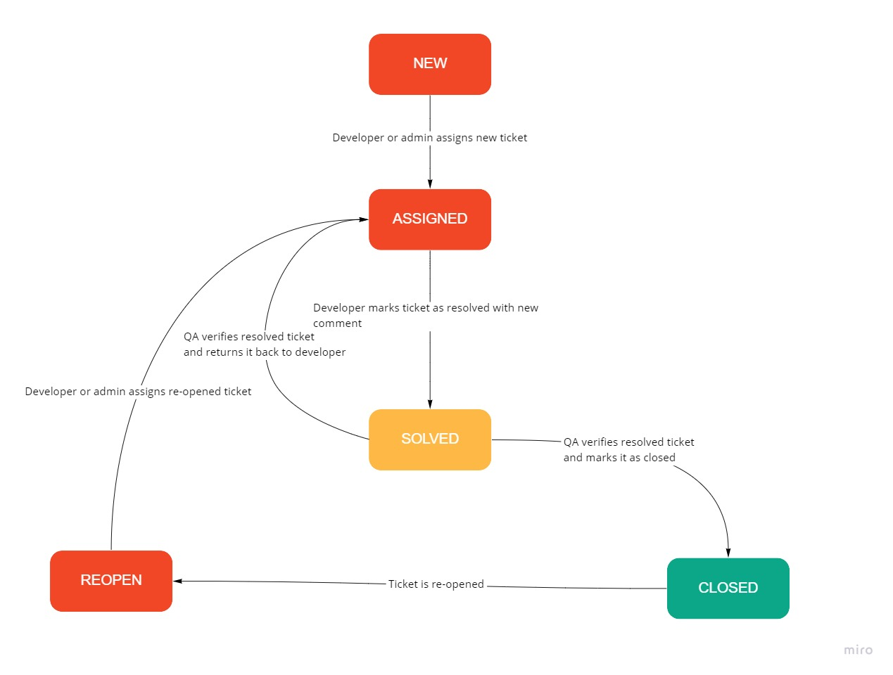
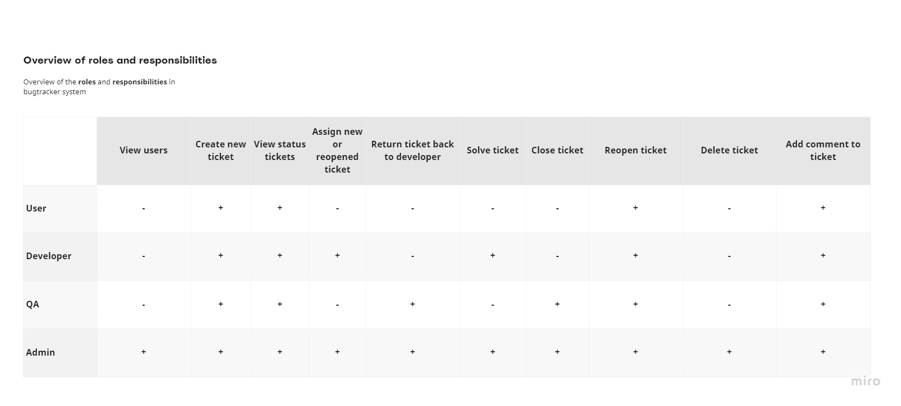
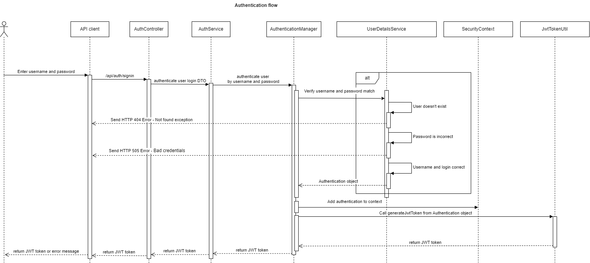
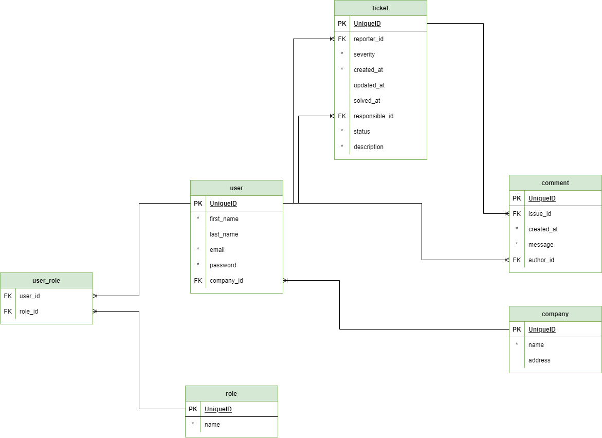
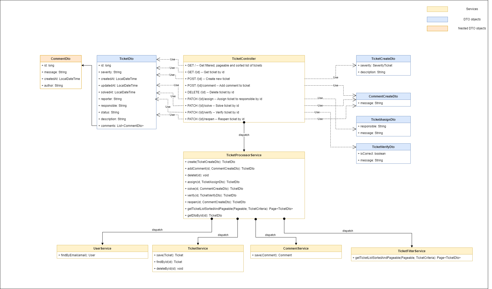

# Simple Bugtracker application
This Simple Bugtracker application developed by test assignment requirements as a part in recruitment process.

## Overview

### Task description
Implement a simple bug tracker as a REST service.

Please implement a bug tracker service before the interview:
<ol>
<li>The restful API should support the standard operations like create, retrieve and update a simple bug ticket.
<li>The service should be implemented in Java and make use of Spring Boot and probably some other Spring modules.
<li>You may use a database of your choice (in-memory data store is allowed)
<li>We like testing, so please also provide appropriate tests using JUnit and Mockito.
<li>After your presentation of your service, we think together of an additional test or an additional feature and would like to see how you implement it.
</ol>

General
<ol>
<li>Use Java and Spring-Boot
<li>You can use every resource you want (web, other code, etc.)
</ol>

Please prepare for the interview:
<ol>
<li>Set up the project and add needed dependencies
<li>Implement a REST API with CRUD functionalities
<li>Add/use a database of your choice (in-memory data store is allowed)
<li>Test your application
<li>Bonus (optional): Dockerize your application
</ol>

### Technologies
During application development were used following languages, frameworks, libraries and tools.

| Component | Description |
| --- | --- |
| Java 11 | OOP programming language |
| Spring Boot | IoC, DI framework |
| Spring Security | Spring component for security the application |
| Spring Data JPA | Spring ORM component for persistence entities into database |
| PostgreSQL |  SQL relation database |
| Liquibase |  Database migration tool|
| Lombok | Compilation plugin |
| Apache Maven |  Software project management and comprehension tool |
| Junit 5 | Testing frameworks on the JVM |
| Mockito | Mocking framework|
| Testcontainer | Java library that supports JUnit tests, providing lightweight, throwaway instances of common databases |
| Swagger | API development tool |
| JJWT  |  Pure Java implementation for JWT specification |
| JHipster  |  Web development framework |
| Docker  |  Container tool |


### Application logic
Application logic is based on handling tickets which contain information about bug and history of its resolving. Ticket lifecycle represents on schema bellow.



### User roles and management
Application supports 4 different kinds of user roles with different privileges level:
1. User
2. Developer
3. QA
4. Admin

The table below shows overview of the  roles and responsibilities in bugtracker application.


### Authentication
Application authentication is based on Spring Security functionality. For authenticate HTTP request is using JWT tokens previously issued by application itself.

JWT secret using for generation and verification tokens and JWT expiration period can be defined by properties in Spring application properties configuration file:
```
jwt.secret
jwt.expirationHours
```
Sequence diagram describes authentication process.


### Model
Application database contains entities and their relationship as it shows on  Entity-Relationship diagram bellow.


Initial database data is defined in data.sql file in project resource folder. Every start application data drops and populates again.

### UML diagram
Application implements Controller-Service-Repository pattern with dedicated layers of controller, service and repository services.

The UML diagram bellow shows scenario for CRUD operations on ticket and how those are handling by application components (classes).


### REST API contract
REST API contract is available on Swagger page at URL path:
```
http://<application host>:<application port>/api/swagger-ui/index.html
```

## Deployment
### Testing
During developing stages were used following testing methods:
1. Unit testing. 
2. Integration testing (with reading, updating and writing data into and from isolated database running inside Testcontainer instance).
3. Manual testing using Postman application.

Current test coverage amount is 79%.

### Configure the application
Before running application you should set up following environment variables:

| Variable | Value |
| --- | --- |
| `BUGTRACKER_SERVICE_PORT` | Application TCP port for processing requests to REST API |
| `BUGTRACKER_DB_USERNAME` | Database username |
| `BUGTRACKER_DB_PASSWORD` | Database password |
| `BUGTRACKER_DB_URL` | Database URL |

Also, it is possible to configure JWT token parameters as it describes "Authentication" section above.

### Dockerize application
For running application inside Docker container application repository contains Dockerfile with script for build application using Apache Maven tool and prepare the container.

To run application as Docker container you should perform following actions:

1. Build a container image
```
docker build --no-cache -t kssadomtsev/app-bugtracker .
```

2. Make sure that image was build
```
docker images
```

3. Run the container (make sure that you have configured environment variables or provide them in command!)
```
docker run --name app-bugtracker kssadomtsev/app-bugtracker
```
For simplify process or start application with database you can use docker-compose command. docker-compose.yml contains script for starts application with database.
Using variables inside .env file you can configure application and database parameters:

| Variable | Value |
| --- | --- |
| `BUGTRACKER_DB_USERNAME` | Database username |
| `BUGTRACKER_DB_PASSWORD` | Database password |
| `BUGTRACKER_DB` | Database name |
| `POSTGRESQL_LOCAL_PORT` | Postgresql host port  |
| `POSTGRESQL_DOCKER_PORT` | Postgresql container port  |
| `SPRING_LOCAL_PORT` | Application host port  |
| `SPRING_DOCKER_PORT` | Application container port  |


To run application and database as Docker containers you perform following actions:
1. Build and start containers in detached mode
```
docker-compose up --d --build
```
2. Make sure that both of them were started
```
docker ps
```
3. Stop container if needed:
```
docker-compose down
```
or
```
docker-compose down --rmi all
```

## Improvement
Ideas of possible improvement in application design and functionality:
1. Introducing Spring Security ACL. Needed for provide an exact and strict user access only to their own data.
2. External authentication provider (Keycloack). Needed for having possibility of developing more microservices which will use common authentication point.
3. Migration to microservices architecture. To make application redundant, available and scalable.
4. Don't use data.sql script. For keep changes after application restart.
5. Introducing Camunda framework (https://camunda.com/). From my experience Camunda framework is a convenient solution to describe workflow of entity (Ticket in this case).
6. Separate Git branches into dev and prod branches.
7. Add Spring profiles for dev and prod environment.
8. Build a CI/CD pipeline.

## Questions

Will be glad to discuss the application design and answer for all your questions! Please reach my by following contacts:
1. Email: kssadomtsev@gmail.com
2. Telegram: https://t.me/C0nstantineS
3. Phone: +79852280664